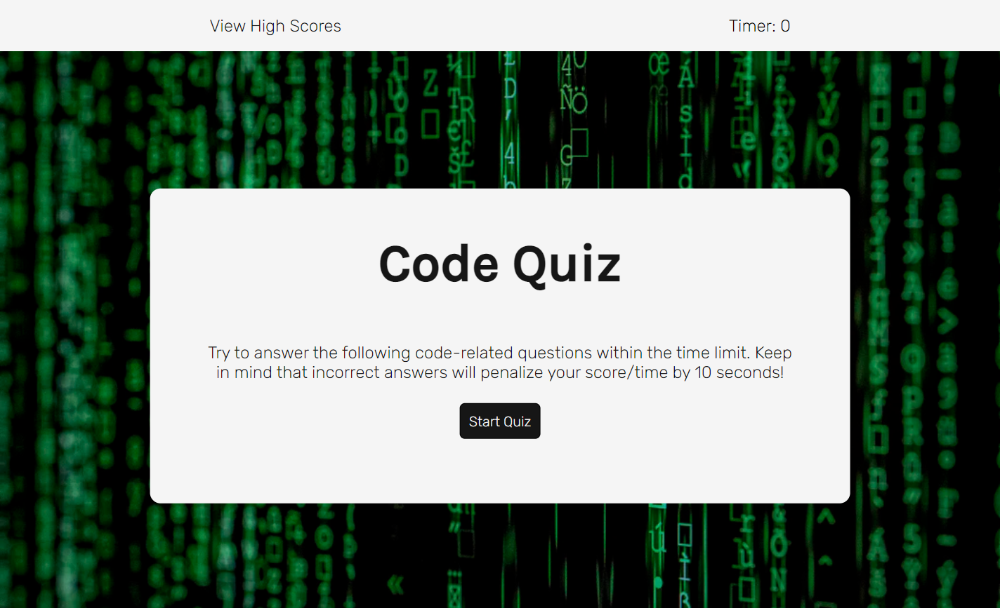
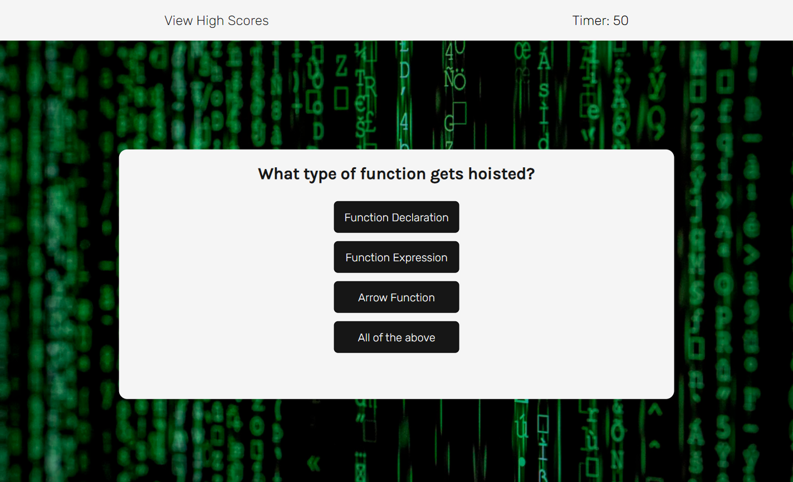
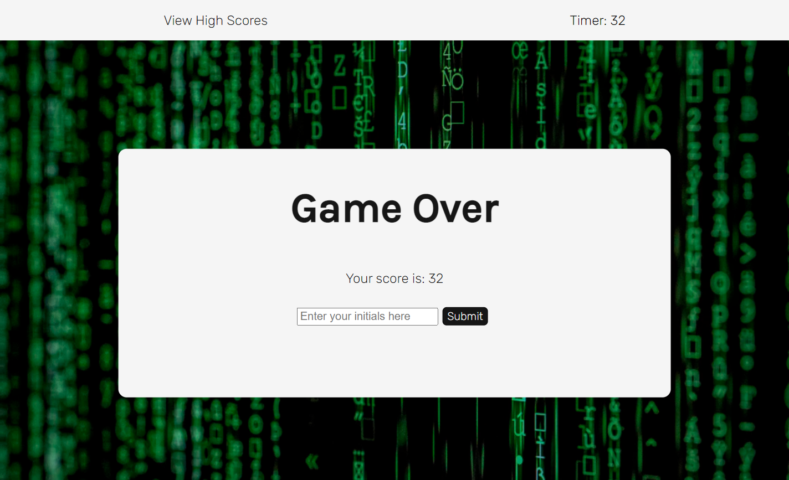
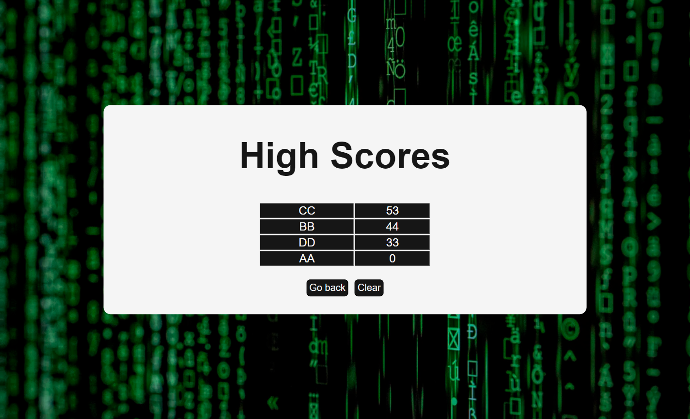

# Code Quiz

## Table of Contents

[Description](#description)  
[Technologies Used](#technologies-used)  
[Link to Deployed Application](#link-to-deployed-application)  
[Getting Started](#getting-started)  
[Screenshots](#screenshots)

## Description

The aim of this project was to create a coding quiz which dynamically renders as the quiz progresses. The quiz includes a timer that starts when the start button is clicked, dynamically rendered question cards, a high scores table that displays the user's previous scores and the ability to save scores to local storage. This project uses HTML, CSS and JavaScript.

## Technologies Used

- HTML5
- CSS
- JavaScript

## Link to Deployed Application

Click [here](https://chelseanicholls95.github.io/code_quiz/) to view project.

## Getting Started

```
git clone git@github.com:chelseanicholls95/code_quiz.git
cd code_quiz
code .
```

## Screenshots








